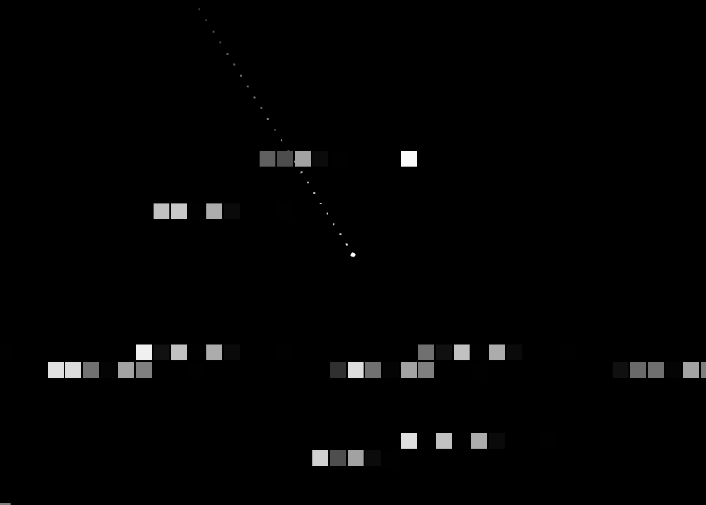
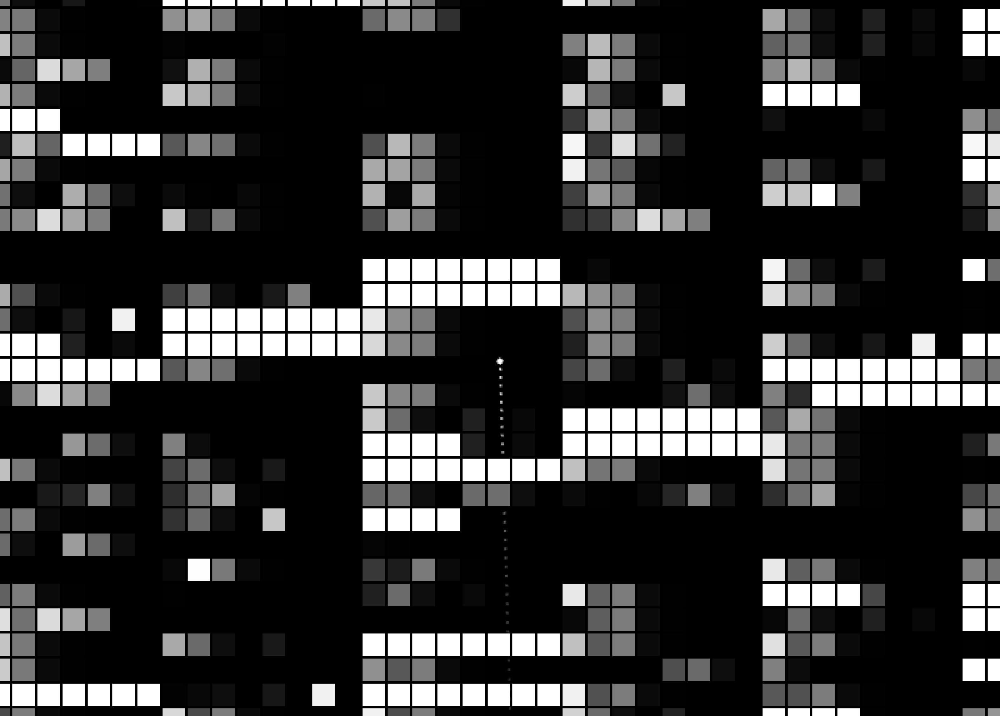

# MemgameJS
A memory region adventure game

## How to run

Please execute following command with Python 2.7.

npm install && npm start

## Screenshots

## How to play

Japanese -> HOWTOPLAY.ja.md  
English -> HOWTOPLAY.en.md

## LICENSE

This software is released under the MIT License. See LICENSE.txt.
